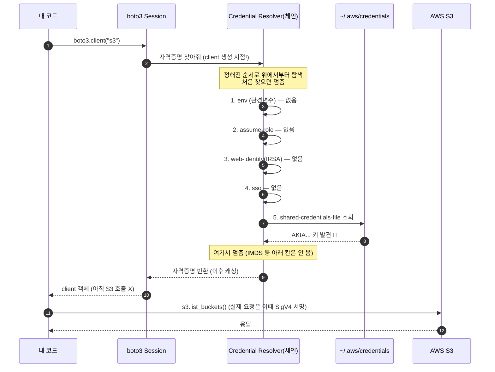
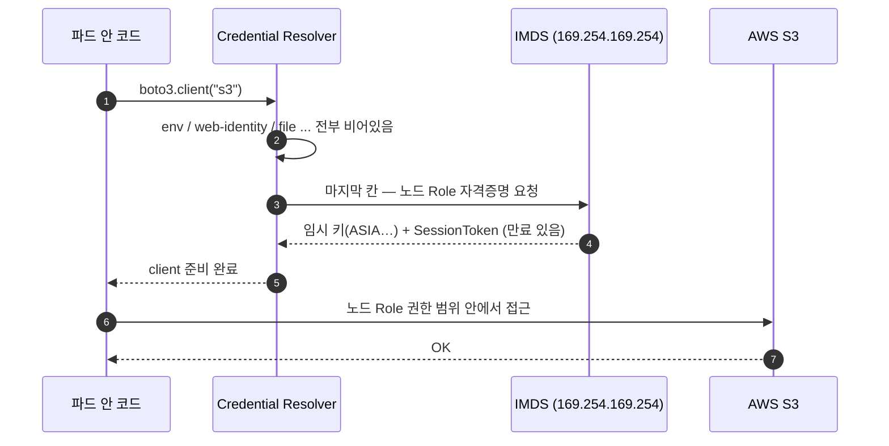

## 한 줄 정의 (Feynman)
> **자격증명 체인** = SDK/CLI가 "내 신분증(키) 어디 있지?" 하면서 **정해진 장소를 정해진 순서로 뒤지다가, 처음 찾은 곳에서 멈추는** 규칙.

---

## TL;DR

- `aws sts get-caller-identity` 나 `boto3.client("s3")` 는 키를 안 적어도 동작한다. SDK가 **체인을 순서대로 뒤져서** 신분증을 자동으로 찾기 때문.
- 순서(boto3 기준, 실측): **env → assume-role → web-identity(IRSA) → sso → 파일(`~/.aws/credentials`) → … → IMDS**. **위 칸이 아래 칸을 덮어쓴다.**
- 탐색은 **`client()` 만드는 시점**에 일어나고, 한 번 찾으면 **캐싱**된다.
- EC2/EKS에선 env·파일이 비어서 마지막 칸 **IMDS(`169.254.169.254`)** 까지 내려가 **노드 Role의 임시 키(`ASIA…` + SessionToken)** 를 줍는다.
- 디버깅 한 줄: "왜 이 신분으로 붙지?" → **어느 칸에서 키를 주웠는지**(`aws configure list` 의 `Type`)가 범인을 가리킨다.

> ⚠️ 이 글은 실제 학습 세션에서 나왔는데, 시작은 **내 시크릿 키를 터미널에 그대로 노출시킨 사고**였다. 그 사고가 역설적으로 오늘 주제(영구 키 vs 임시 키)의 정중앙을 찔렀다. 4번 섹션에 솔직하게 남긴다.

---

## 1. 핵심 내용 / 구조

### 출발점: 키를 안 적었는데 왜 인증되지?

```bash
$ aws sts get-caller-identity
{
    "Arn": "arn:aws:iam::183171474029:user/siwoo-api"
}
```

명령에 access key를 한 글자도 안 넣었는데 AWS는 나를 알아봤다. CLI가 **어딘가에서 신분증을 자동으로 찾아** 요청에 끼워넣었다는 뜻이다. 그 "자동으로 찾는 과정"이 credential chain이다.

### 신분증(credential)의 정체

- **Access Key ID** (`AKIA…` 공개 ID) + **Secret Access Key** (비밀)
- **임시 자격증명**일 땐 여기에 **Session Token** 이 붙고, 키가 `ASIA…` 로 시작하며 **만료 시간**이 있다. → 이게 Role 이야기의 핵심.

### 체인의 순서 (boto3/botocore 실측)

위에서부터 뒤지고, **처음 찾으면 멈춘다.**

```text
① env                          AWS_ACCESS_KEY_ID / SECRET / SESSION_TOKEN
② assume-role                  config 의 role_arn + source_profile
③ assume-role-with-web-identity  AWS_WEB_IDENTITY_TOKEN_FILE   ← IRSA(EKS 파드)
④ sso
⑤ shared-credentials-file      ~/.aws/credentials
⑥ (config-file / process …)
⑦ container / IMDS             169.254.169.254               ← EC2 · EKS 노드 Role
```

### boto3.client("s3") 한 줄이 하는 일 (로컬에서 파일을 찾는 경우)



`client()` 는 **"S3에 연결"이 아니라 "요청 보낼 도구를 조립"** 하는 단계다. 실제 통신은 `list_buckets()` 같은 호출 때 일어난다.

### EC2 / EKS 파드에서는 — 끝까지 내려가 IMDS



---

## 2. 무엇을 배웠나

- **체인은 "순서"가 전부다.** 위 칸에 뭐가 있으면 아래 칸은 무시된다.
- **EKS 권한 구조는 Role이 2종류**다. 어느 쪽에서 권한이 오는지 알아야 한다.

| Role | 누가 씀 | 비유 | S3 권한 위치 |
|---|---|---|---|
| **Cluster IAM Role** | EKS 컨트롤 플레인(관제탑) | 매니저 (지휘만) | 보통 없음 (파드와 무관) |
| **Node IAM Role** | 워커 노드(EC2) = 파드 | 요리사 (실제 일함) | 여기 또는 IRSA |

- **파드가 S3를 쓰는 경로는 2개**: ① 노드 Role(기본) ② IRSA(파드 전용 Role, web-identity 칸). IRSA가 붙어 있으면 노드 Role 대신 그게 이긴다.
- **IMDS** = `169.254.169.254`. 인스턴스 내부에서만 닿는 link-local 정보 창구. 인스턴스 메타데이터뿐 아니라 **붙은 Role의 임시 키**를 내준다.

---

## 3. 내가 오해하고 있던 것 (제일 귀한 부분)

**오해 ①: "파일(`~/.aws/credentials`)이 환경변수 다음으로, web-identity보다 먼저 탐색된다."**
- 정정: boto3 로그를 직접 보니 **`web-identity(IRSA)` 가 파일보다 *먼저*** 였다. 실제 순서는 `env → assume-role → web-identity → sso → file`.
- 왜 헷갈렸나: 로컬에서만 써봐서 "환경변수 아니면 파일"이라는 2단 구조로 단순화하고 있었다. IRSA가 파일을 이겨야 EKS 파드가 의도대로 동작한다는 걸 순서가 말해준다.

**오해 ②: "자격증명은 실제 API 호출할 때(lazy) 찾을 것이다."**
- 정정: 로그가 `client()` 생성 시점(STEP A~B 사이)에 다 찍혔다. **client 조립 단계에서 바로(eager) 탐색**하고 캐싱했다. 두 번째 `get_credentials()` 호출엔 탐색 로그가 아예 안 나왔다.

**오해 ③(사고로 배움): "키를 파일에 두는 건 그냥 좀 번거로운 정도."**
- 정정: 세션 중 마스킹 명령(`sed`)이 macOS BSD에서 안 먹어 **시크릿 키가 평문 노출**됐다. 영구 키(`AKIA…`)는 한 번 새면 끝이고, 직접 rotate 해야 한다. 이게 바로 EC2/EKS에서 **키 파일 대신 Role + IMDS의 임시 키**를 쓰라는 이유다 — 임시 키는 만료되고 자동 갱신된다.
- 키 노출 시 rotate 절차: `create-access-key`(새 키) → 모든 사용처 교체 → `update-access-key --status Inactive`(되돌리기 가능) → 확인 후 `delete-access-key`. **옛 키부터 지우지 말 것**(다른 서버·CI가 쓰면 장애).

---

## 4. 언제 쓰고, 언제 쓰지 않는가 (Trade-offs)

| 상황 | 방식 | 적합도 | 이유 |
|---|---|---|---|
| 로컬 개발 PC | `~/.aws/credentials` 파일 | ✅ | 간편. 단 영구 키라 유출 주의 |
| CI/임시 작업 | 환경변수 | ⚠️ | 편하지만 **다른 칸을 덮어쓴다** — 옛 키가 남아 엉뚱한 계정 붙는 사고 잦음 |
| EC2 / EKS 노드 | 노드 Role + IMDS | ✅ | 영구 키 불필요, 임시 키 자동 갱신 |
| EKS 파드(세분화) | IRSA / Pod Identity | ✅✅ | 파드 단위 최소 권한. web-identity 칸이 파일을 이김 |
| 운영 서버에 키 파일 박기 | 파일/env | ❌ | 유출 시 피해 영구. Role로 대체할 것 |

---

## 5. 직접 실험

### 실험 A — 체인이 순서대로 뒤지는 걸 로그로 본다

```python
import sys, logging, boto3
h = logging.StreamHandler(sys.stdout)
h.setFormatter(logging.Formatter("[LOG] %(message)s"))
lg = logging.getLogger("botocore.credentials"); lg.setLevel(logging.DEBUG); lg.addHandler(h)

sess = boto3.Session()
print("STEP A: client 만들기 직전")
s3 = sess.client("s3", region_name="ap-northeast-2")
print("STEP B: client 생성 완료")
creds = sess.get_credentials()
print("STEP D: method =", creds.method, "/ key[:4] =", creds.access_key[:4])
```

**결과 (env 없을 때):**
```text
STEP A: client 만들기 직전
[LOG] Looking for credentials via: env
[LOG] Looking for credentials via: assume-role
[LOG] Looking for credentials via: assume-role-with-web-identity
[LOG] Looking for credentials via: sso
[LOG] Looking for credentials via: shared-credentials-file
[LOG] Found credentials in shared credentials file: ~/.aws/credentials
STEP B: client 생성 완료
STEP D: method = shared-credentials-file / key[:4] = AKIA
```
→ 관찰: 탐색 로그가 **STEP A~B 사이**(client 생성 시점)에 다 찍힘. 파일에서 찾자 **그 아래(IMDS)는 보지도 않음**. STEP D의 `get_credentials()` 엔 로그 없음 = **캐싱됨**.

### 실험 B — 우선순위: 환경변수가 파일을 덮어쓴다

```bash
AWS_ACCESS_KEY_ID=AKIAFAKE AWS_SECRET_ACCESS_KEY=fake python chain_demo.py
```
**결과:**
```text
[LOG] Looking for credentials via: env
[LOG] Found credentials in environment variables.
STEP D: method = env
```
→ 관찰: 가짜 env 하나 켰을 뿐인데 **①에서 즉시 멈춤**. 파일(⑤)은 쳐다도 안 봄. **위 칸이 아래를 무조건 이긴다**가 증명됨.

> 두 실험의 차이 = `method` 값(`shared-credentials-file` ↔ `env`). 실무에서 "왜 이 신분으로 붙지?" 디버깅의 핵심 단서다.

### 실험 C — Role 정책에서 S3 권한 읽기 (노드 Role 사례)

```json
{ "Effect": "Allow", "Action": ["s3:ListBucket"],
  "Resource": ["arn:aws:s3:::aws-system-patch-log"] },        // 버킷 자체 = List
{ "Effect": "Allow", "Action": ["s3:*"],
  "Resource": ["arn:aws:s3:::aws-system-patch-log/*"] }        // /* = 객체 = Read/Write 등
```
→ 읽는 법: `arn:…:bucket`(슬래시 없음)=버킷 레벨, `arn:…:bucket/*`=객체 레벨. `"Resource":"*"` 면 **모든 버킷**(주의). "S3 권한 있나?"는 이름(`AmazonS3*`)뿐 아니라 **`AdministratorAccess`/`"Action":"*"`** 로도 올 수 있으니 JSON 본문을 봐야 한다.

---

## 6. IMDS와 보안 (IMDSv1 vs v2)

IMDS에서 Role 키를 받는 실제 경로:
```text
GET  …/latest/meta-data/iam/security-credentials/            → Role 이름
GET  …/latest/meta-data/iam/security-credentials/<Role>      → {AccessKeyId: ASIA…, Token, Expiration}
```

| | v1 | v2 |
|---|---|---|
| 방식 | GET 한 방 | PUT으로 토큰 먼저 → 헤더에 담아 GET |
| SSRF 방어 | ❌ 취약 (Capital One 2019) | ✅ 단순 GET-SSRF로 키 탈취 불가 |
| 권장 | — | **`HttpTokens: required`(v1 비활성)** |

> SSRF: 공격자가 서버더러 임의 URL을 fetch하게 만드는 버그. v1이면 `169.254.169.254` 를 GET시켜 Role 키를 통째로 훔칠 수 있다. v2는 커스텀 헤더+PUT을 요구해 이를 막는다. EC2 콘솔 → 인스턴스 → 메타데이터 액세스에서 `required` 확인.

---

## 7. 다른 개념과의 연결

- **상위 개념**: IAM(누가 무엇을 할 수 있나), SigV4 서명(찾은 키로 요청에 서명)
- **연관 개념**: IRSA / EKS Pod Identity(파드 단위 Role), STS(임시 자격증명 발급), SSRF(IMDS 보안)
- **비교 대상**: 영구 키(`AKIA…`, 파일/env) ↔ 임시 키(`ASIA…`, Role/IMDS/STS)

### 관련 글
- [MISO sheet_analysis 를 EKS 로 이관하며 배운 것들](/project/miso-sheet-analysis-eks-migration/) — 이 글의 노드 Role·IRSA가 실제로 쓰인 EKS 환경
- [K8s 볼륨 모델 — emptyDir, PV, PVC, AccessMode 의 진짜 의미](/cs/kubernetes-volume-model-pv-pvc-accessmode/) — 같은 EKS 위 또 다른 추상화(스토리지) 이해
- [WSGI·ASGI·async부터 gunicorn·uvicorn까지 — 파이썬 백엔드 스택 바닥부터 풀기](/cs/python-web-server-async-stack/) — 이 체인을 타는 boto3가 도는 파이썬 백엔드 층

<!-- 앞으로 쓸 글 후보: STS / AssumeRole 깊게, IRSA 셋업 실습, SigV4 서명 직접 구현 -->
